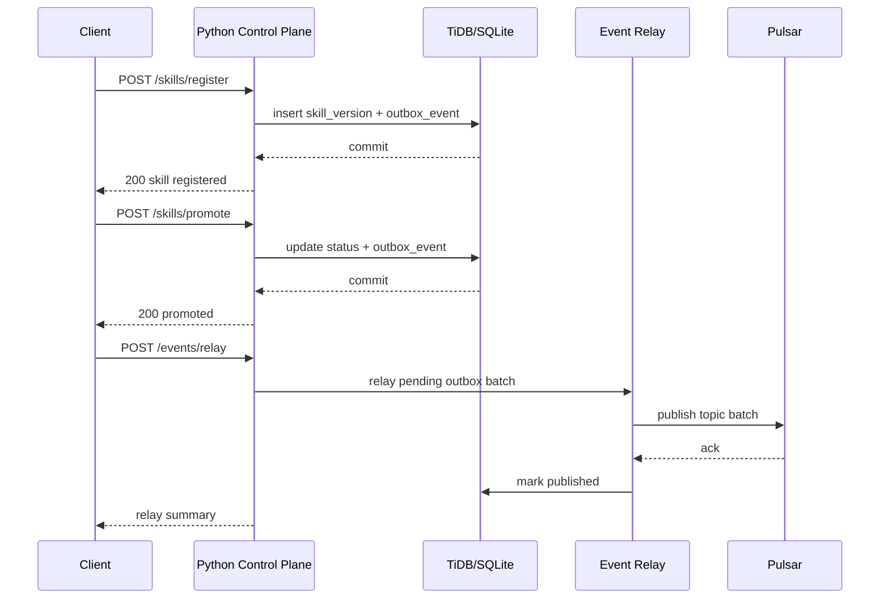
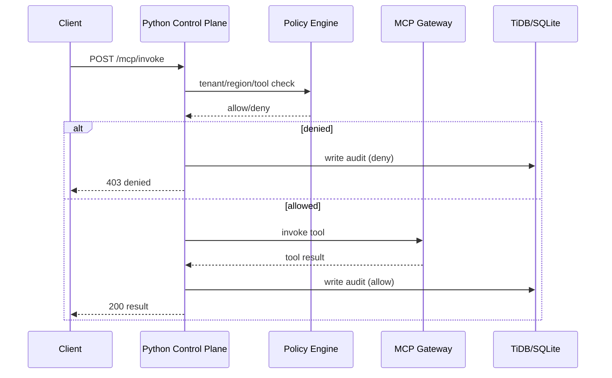
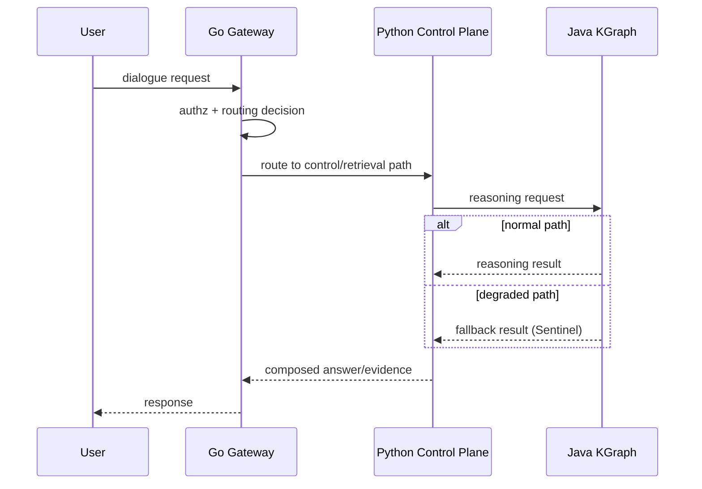

# Interaction Sequence Diagrams

## 1. Skill Registration + Promotion + Event Relay

```mermaid
sequenceDiagram
    participant Client
    participant CP as Python Control Plane
    participant DB as TiDB/SQLite
    participant Relay as Event Relay
    participant Bus as Pulsar

    Client->>CP: POST /skills/register
    CP->>DB: insert skill_version + outbox_event
    DB-->>CP: commit
    CP-->>Client: 200 skill registered

    Client->>CP: POST /skills/promote
    CP->>DB: update status + outbox_event
    DB-->>CP: commit
    CP-->>Client: 200 promoted

    Client->>CP: POST /events/relay
    CP->>Relay: relay pending outbox batch
    Relay->>Bus: publish topic batch
    Bus-->>Relay: ack
    Relay->>DB: mark published
    CP-->>Client: relay summary
```

## 2. MCP Invoke with Policy and Audit

```mermaid
sequenceDiagram
    participant Client
    participant CP as Python Control Plane
    participant Policy as Policy Engine
    participant MCP as MCP Gateway
    participant DB as TiDB/SQLite

    Client->>CP: POST /mcp/invoke
    CP->>Policy: tenant/region/tool check
    Policy-->>CP: allow/deny
    alt denied
        CP->>DB: write audit (deny)
        CP-->>Client: 403 denied
    else allowed
        CP->>MCP: invoke tool
        MCP-->>CP: tool result
        CP->>DB: write audit (allow)
        CP-->>Client: 200 result
    end
```

## 3. Gateway Route + KGraph Fallback

```mermaid
sequenceDiagram
    participant User
    participant GW as Go Gateway
    participant CP as Python Control Plane
    participant KG as Java KGraph

    User->>GW: dialogue request
    GW->>GW: authz + routing decision
    GW->>CP: route to control/retrieval path
    CP->>KG: reasoning request
    alt normal path
        KG-->>CP: reasoning result
    else degraded path
        KG-->>CP: fallback result (Sentinel)
    end
    CP-->>GW: composed answer/evidence
    GW-->>User: response
```
